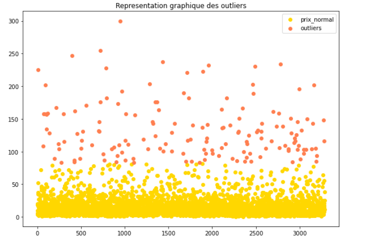
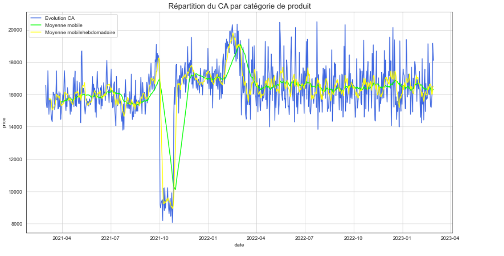

# Analyse marketing avec Python

Ce projet consiste à analyser les ventes et le comportement des clients d'une librairie en linge.

## [Nettoyage - Exploration des données](./Exploration_et_nettoyage_des_données.ipynb)

- Nettoyage des valeurs manquantes.
- Nettoyage des doublons.
- Détection et analyse des valeurs aberrantes.

## [Analyse du chiffre d'affaires et le comportement des clients](./KPIs_et_comportement_client.ipynb)

### Analyse du chiffre d'affaires
- Répartition du chiffre d'affaires sur les clients et les catégories de produits.
- Evolution du chiffre d'affaires
- Chiffre d'affaires glissant
- Top chiffre d'affaires

### Analyse du comportement des clients
- Test du chi carré
- Test de Spearman
- Test ANOVA

## Contenu
1. Notebook préparation et nettoyages des données
2. Notebook analyse KPIs et comportement clients.

## outils
Python, Pandas, Seaborn, Scipy, Numpy

## Données:
- Fichier clients
- Fichier produits
- Fichiers transactions
