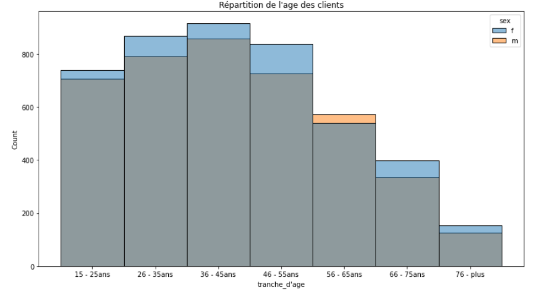
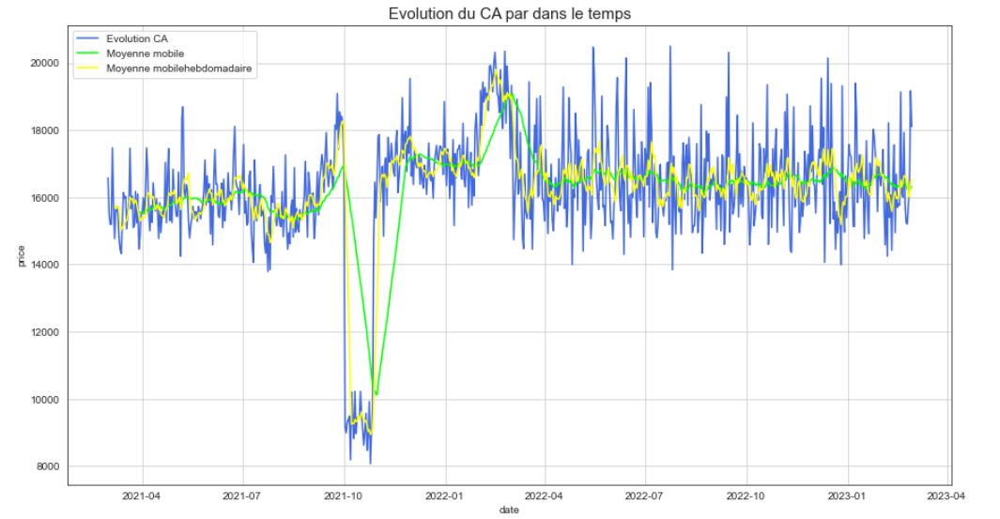
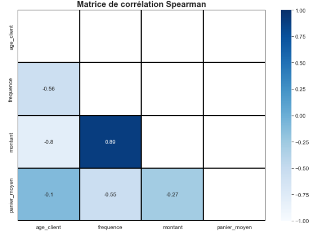

# Analyse marketing avec Python

Ce projet est une analyse des ventes, du chiffre d'affaires et du comportement client d'une librairie en ligne.

Données traitées :

- table **customers** : donne des informations sur les clients
- table **products** : donne des informations sur les produits
- table **transactions** : donne des informations sur des opérations de vente. 

## [Préparation - Exploration des données](./Exploration_et_nettoyage_des_données.ipynb)
Dans cette partie, nous avons essentiellement travailler sur la préparation des données. Dans ce cadre, nous sommes passés par les process suivants:

- Nettoyage des valeurs manquantes.
- Nettoyage des doublons.
- Détection et analyse des outliers.
- consolidation des tables.
 
L'analyse de chacune des variables nous a permis de visualiser et de mieux comprendre les données.

Voir l'image ci-dessous qui nous permet de visaliser la distribution de la variable age à titre d'exemple.

## [Analyses du chiffre d'affaires et du comportement des clients](./KPIs_et_comportement_client.ipynb)

Dans cette partie, nous avons effectué une analyse univariée du chiffre d’affaires pour avoir une bonne maitrise de l'activité et une analyse bivariée pour avoir une compréhension sur le comportement de nos clients.

### Analyse du chiffre d'affaires

- Répartition du chiffre d'affaires sur les clients et les catégories de produits.
- Evolution du chiffre d'affaires dans le temps
- Top chiffre d'affaires

### Analyse du comportement des clients
- Test du chi carré
- Test de Spearman
- Test ANOVA

## outils
Python, Pandas, Seaborn, Scipy, Numpy

## Données:
- Fichier clients
- Fichier produits
- Fichiers transactions
